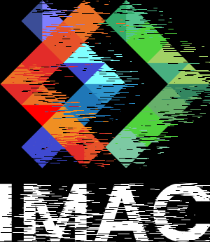
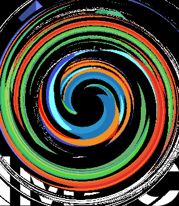
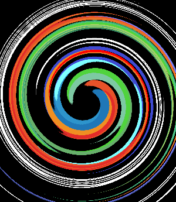

# Mini-rapport de Workshop Iwen Martin

## Voici les avant-après des images traités durant les exercices. Certaines sont accompagnées des difficultées rencontrées mais toutes les explications sont dans le main pour chaque étape de code.

### **Ne garder que le vert**

- Avant :

- Après :

### **Échanger les canaux**

- Avant :

- Après :

### **Noir & Blanc**

- Avant :

- Bug :

- Après :

Ici j'ai eu un soucis car j'ai rajouté une ligne de code en trop qui faisait que si le pixel tendait plus vers le noir que le blanc on le colorait en noir et inversement. Cela donne cependant une image interressante. En otant cette ligne là on obtient bien une image en nuance de gris.

### **Négatif**

- Avant :

- Après :

### **Dégradé**

Ici on a pas d'image de base on créé directement une image noire sur laquelle on va agir.

### **Miroir**

- Avant :

Il y a eu plusieurs fois le même problême mais qui a agit de manière différentes pour cet exercice là.
Pour la première tentative j'ai échangé tous les pixels de position selon x ET y mais en dépassant la moitié de l'image cela ne change plus rien.
- Bug 1:

ensuite j'ai le même soucis puisque j'ai simplement retiré la partie qui échangeait les y de position. La moitié gauche de l'image ne suit toujours aucun changement.
- Bug 2:

Cette fois ci on utilise ici swap qui permet d'échanger de position les pixels directement et qui résout donc le problème qui faisait que l'on traitait des pixels qui avaient déjà changé de position.
- Après :

### **Image bruitée**

- Avant :

- Après :

### **Rotation de 90°**

Le seul soucis que j'ai eu ici était pour comprendre comment tourner du bon coté mais cela dépend de si on agit sur la height ou la width.
- Avant :

- Après :

### **RGB split**

ma difficulté ici a été de correctement séparer en 3 if afin d'avoir le plus bel effet possible. Car en mettant toute les translations de couleurs dans le même if l'effet nétait pas présent sur les bords de l'image (en effet j'ai fait en sorte qu'un pixel ne puisse pas dépasser de l'image si il était déplacé)
- Avant :

- Après :

### **Luminosité**

- Avant :

- Après :

### **Disque**

On part d'une image noire

### **Cercle**

On part d'une image noire

### **Animation**

Ici j'ai eu un soucis car j'avais oublié de delete les pixels colorés en blanc entre chaque frame de l'animation. Pour 100 frame j'obtenais donc ce résultat :

En rendant l'image noir avant chaque génération de nouveau disque j'obtiens le résultat escompté. Pour 30 frame on a : 

### **Rosace**

J'avais ici tout simplement oublié de générer des cercles j'avais donc de tout petits disques mais qui avaient le bon angle de rotation.

j'ai résolu le probleme ensuite mais j'ai deux fonctions. Une où tout le code est détaillé mais qui n'a pas de paramètre qui agissent sur les cercles et donc ne permet pas de manipuler les dimensions de la rosace et un autre qui réutilise la fonction Circle et permet alors d'agi sur certains paramètre de la Rosace.

### **Mosaïque**

- Avant :

- Après :

### **Mosaïque miroir**

- Avant :

- Après :

### **Glitch**

- Avant :

- Après :

### **Tri de pixels**
J'ai commencé par tester la fonction sort:

j'ai ensuite appliqué l'effet :

- Avant :

- Après :

### **Dégradés dans l'espace de couleur Lab**

On réalise un premier dégradé dans l'espace RGB : 

Puis on le transpose dans l'espace Lab :

### **Fractale de Mandelbrot**

On part d'une image noir à la base et on obtient ceci :

### **Normalisation de l'histogramme**

- Avant :

- Après :

### **Vortex**
image de base : 

J'ai eu plusieurs soucis avec la premiere tentative. Des points qui avaient subis une rotation en subissaient à nouveau une et ceux qui n'en subissait car sinon ils sortaient de l'image restaient à leur place et on les voyait en arrière plan : 

J'ai trouvé une parade mais qui ne résolvait le problème qu'en surface en rendant noir les pixels qui ne changeaient pas de place : 

En crééant une nouvelle image et en copiant les pixels apres rotation dedans on résout tous les soucis : 

